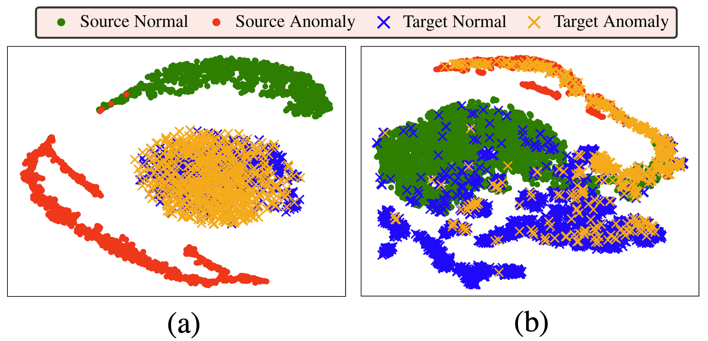

# Cross-Domain Graph Anomaly Detection via Anomaly-aware Contrastive Alignment (ACT)

<a href="https://pytorch.org/get-started/locally/"></a>

The official PyTorch implementation of **Cross-Domain Graph Anomaly Detection via Anomaly-aware Contrastive Alignment**, AAAI2023, to appear.

By Qizhou Wang, Guansong Pang, Mahsa Salehi, Wray Buntine and Christopher Leckie.

<p align="center">

</p>

t-SNE visualisation of a CD GAD dataset before (a) and after (b) our anomaly-aware contrastive alignment. Compared to (a) where the two domains show clear discrepancies in different aspects like anomaly distribution, in (b) our domain alignment approach effectively aligns the normal class, while pushing away the anomalous nodes in both source and target domains from the normal class.

## Requirements
<li>python==3.8.12
<li>pytorch==1.8.0
<li>pytorch geometric==2.0.1
<li>numpy==1.21.2
<li>scipy==1.7.1
<li>cudatoolkit==11.1.1
<li>scikit-learn==1.0.1
<li>geomloss==0.2.4

## Instructions

Miniconda/Anaconda is recommended for setting up the dependencies.
```bash
git clone https://github.com/QZ-WANG/ACT
cd ACT
conda env create -f env/environment.yml
```
To set up the dataset directories,place the files as the following:
```
datasets/
├── Amazon
│   └── Amazon.mat
├── YelpHotel
│   └── YelpHotel.mat
├── YelpNYC
│   └── YelpNYC.mat
└── YelpRes
    └── YelpRes.mat
```
Note that we are seeking the approvals from the owners of the datasets to make them available. Meanwhile, please contact the author of COMMANDER (Ding et al. 2021) for the datasets.

## Getting started
To run the framework:
```bash
chmod +x ./script/pipeline.sh
./script/pipeline.sh <name-of-pipeline-config-file>
```
Please see the sample meta config file in `./exp/pipelines/config`.

## Acknowledgement

This repository is developed using [PyTorch Geometric](https://pytorch-geometric.readthedocs.io/en/latest/). We thank the authors of COMMANDER (Ding et al. 2021) for sharing the datasets. 
